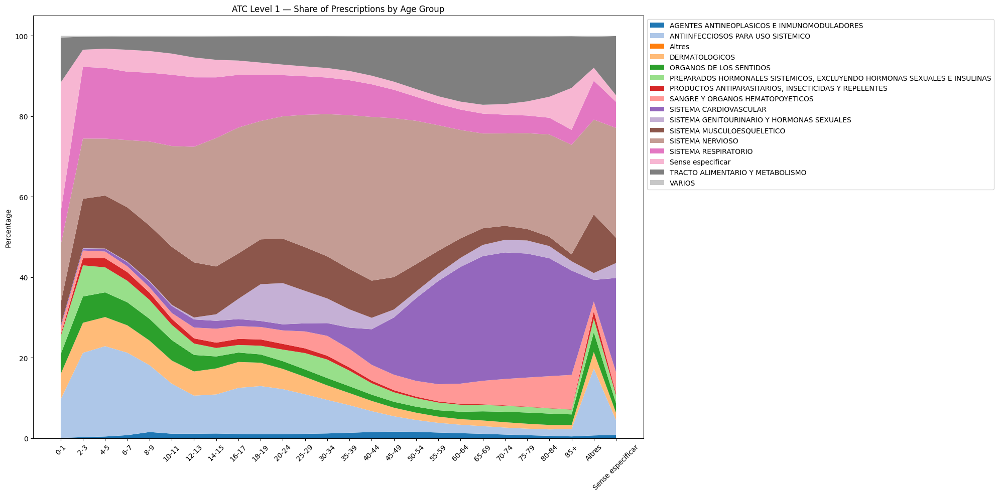
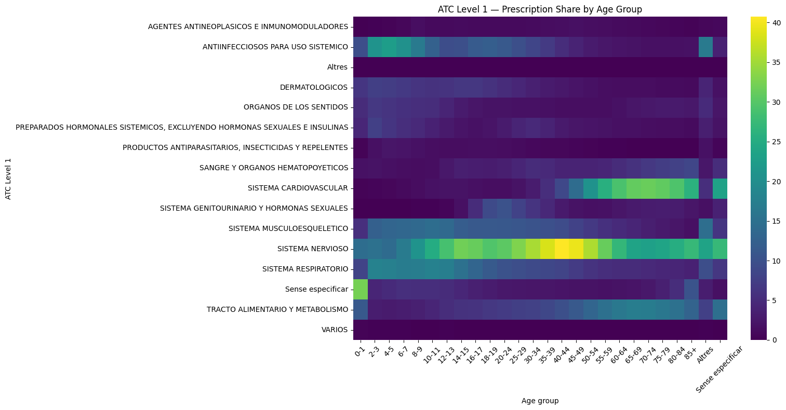
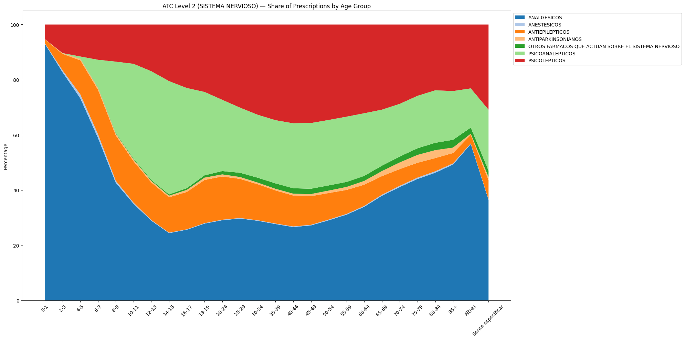
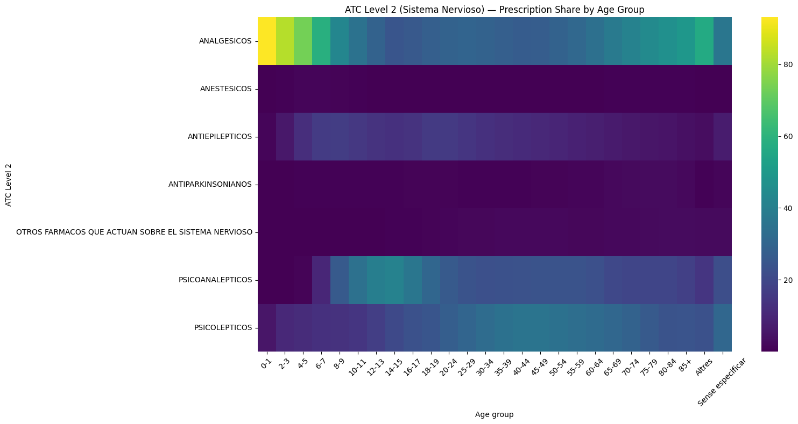
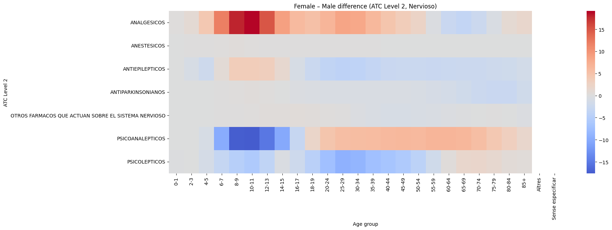
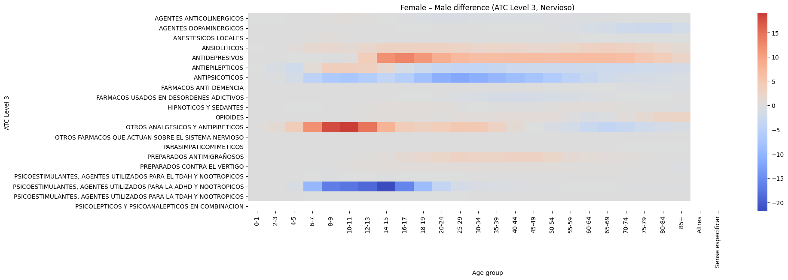
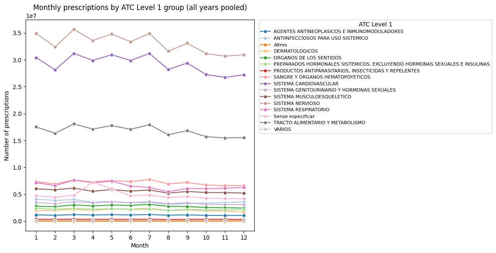

# Catalunya Prescription Patterns — Vanja's Conclusions

## 0. Notebooks

All analyses and plots are generated in notebooks:
- [`nervioso_analyses.ipynb`](./analysis/nervioso_analyses.ipynb)
- [`initial_prescriptions_analyses.ipynb`](./analysis/initial_prescriptions_analyses.ipynb)

## 1. Introduction

This data story analyzes **prescription patterns in Catalonia** using the official ATC (Anatomical Therapeutic Chemical) classification system.  
Our goal is to understand **how medicine use evolves across age, sex, region, and time**, with special focus on the **Nervous System (ATC Level 1: N — “SISTEMA NERVIOSO”)** category because of its importance in mental health, chronic pain, and neurological disease.

The findings are grounded in the visualizations in:

- `/plots/aggregated/all_drugs/atc1_age/*`
- `/plots/aggregated/all_drugs/atc1_temporal/*`
- `/plots/age_and_sex/aggregated/nervioso_drugs/atc2_age/*`
- `/plots/age_and_sex/aggregated/nervioso_drugs/atc3_age/*`

Each section below references these figures explicitly.

---

# 2. High-Level Conclusions From ATC Level 1 (All Drug Categories)

**Relevant plots:**  

## 2.1 Childhood & Adolescence (0–14)  

In the earliest age groups, prescriptions are dominated by **acute and episodic conditions**, not long-term chronic diseases.

Key patterns:

- **Anti-infectives** peak strongly in early childhood (typical of infections).  
- **Respiratory system drugs** (asthma, bronchitis, allergy) form the largest share.  
- **Very little cardiovascular or metabolic medication**, reflecting low chronic disease burden.  

**Conclusion:**  
Children are treated mostly for infections and respiratory problems, matching expected pediatric epidemiology.

## 2.2 Early Adulthood (20–40)  

Prescribing stabilizes and begins shifting toward lifestyle-related and early chronic conditions.

Key trends:

- Cardiovascular drugs begin their long ascent.
- Metabolic/gastrointestinal drugs become more relevant.
- Musculoskeletal medications increase gradually.
- **Nervous-system medications start rising** due to:
  - anxiety/depression diagnoses,
  - sleep disturbances,
  - chronic pain onset.

**Conclusion:**  
This age range marks the transition from acute illnesses toward chronic or stress-associated conditions.

## 2.3 Midlife to Early Senior Years (45–75)  

Two categories dominate:

### Cardiovascular drugs  

Increase dramatically due to hypertension, cholesterol treatment, blood thinners, and cardiac protection.

### Nervous system drugs  

Rise steadily and become one of the **largest prescription categories** in Catalonia.

This reflects:

- chronic pain,
- depression and anxiety,
- insomnia,
- neurological symptoms.

**Conclusion:**  
Midlife brings a dual burden: **heart disease + mental-health / neurological symptoms**.

## 2.4 Late Age (75+)  

Elderly individuals display a broad **polypharmacy** pattern:

- Cardiovascular + metabolic drugs dominate.
- Nervous-system drugs remain consistently high (dementia, pain, sedatives).
- Musculoskeletal and sensory-organ drugs shrink proportionally only because chronic-disease categories balloon.

**Conclusion:**  
The 75+ population is treated for **multi-organ chronic dysfunction**, with nervous-system drugs maintaining a major role.

---

# 3. Nervous System (ATC Level 1) — Deep Dive

**Relevant plots:**  

## 3.1 ATC Level 2 — “What type of Nervous System drugs are used at each age?”  

### Childhood (0–14)  

- **Analgesics** dominate almost 90–95%.  
- Nearly no psychoactive medication.

### Adolescence to Early Adulthood (10–30)  

- Sharp increase in:
  - antidepressants,
  - anxiolytics,
  - ADHD stimulants,
  - antiepileptics.

### Midlife (30–60)  

- **Psychoanaleptics + Psycholeptics** dominate.  
- Chronic pain drugs rise.

### Older Age (60–85+)  

- Analgesics rise again (chronic pain).  
- Antidementia and antiparkinsonian drugs become visible.  
- Sedatives remain high.

**Conclusion:**  
Nervous-system needs follow **three life phases**:  
**Childhood → pain**  
**Adolescence/midlife → mental health**  
**Older age → neurodegeneration + chronic pain**

## 3.2 ATC Level 3 — “Which exact subcategories drive these trends?”  

Key discoveries:

- Childhood: dominated by **“Otros analgésicos y antipiréticos”**.
- Adolescence: rise of antidepressants and stimulants.
- Young adults: peak in antidepressants, anxiolytics, sedatives.
- Midlife: opioids emerge significantly.
- Older age:  
  - anti-dementia,  
  - antiparkinsonians,  
  - opioids (chronic/degenerative pain),  
  - sedatives.

**Conclusion:**  
Each decade of life has a distinct pharmacological profile.

---

# 4. Gender Differences

**Relevant plots:**  

Main findings:

### ADHD (stimulants)  

- Strong **male dominance** at ages 6–18 (as expected).

### Antidepressants  

- Strong **female dominance** at ages 14–60.

### Analgetics and Antipiretics  

- Female-dominated across adolescence and adulthood.

### Antiparkinsonians  

- Male-dominated in older ages (as expected).

**Conclusion:**  
Gender patterns follow known epidemiological trends.  

---

# 5. Temporal Trends (Years & Months)

**Relevant plots:**  

## 5.1 Yearly Trends  

- Many groups rise during 2020–2022 (COVID period).  
- Nervous-system prescriptions show stable long-term growth.  
- Anomalies in **“Sense especificar”** during 2020 suggest classification noise or missing data.

## 5.2 Monthly Seasonality  

- Respiratory drugs ← strong winter peaks (Jan–Mar).  
- Nervous-system drugs ← stable with small spring uptick.  
- Cardiovascular and metabolic drugs ← stable year-long.

---

# 6. Synthesis — What Story Does the Data Tell?

Across all ATC levels, we see **four major life transitions**:

### **1. Childhood** → infections, respiratory care, acute pain  

### **2. Adolescence/Young adulthood** → mental-health onset, neurological disorders  

### **3. Midlife** → cardiovascular disease + psychiatric/chronic pain  

### **4. Old age** → metabolic disease + neurodegeneration + pain

The Nervous System category is a **mirror of population well-being**, tracking mental-health, neurological, and pain-related needs throughout life.
